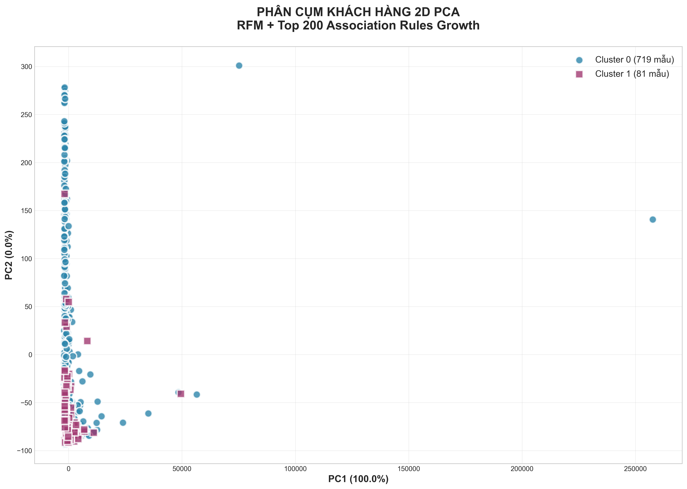
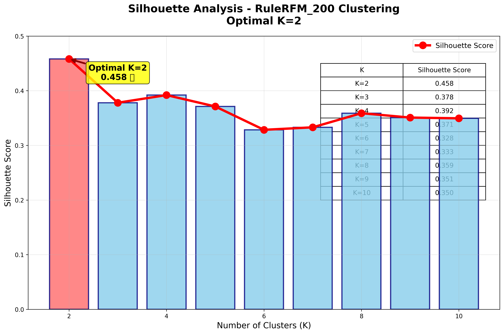

# 📦 Case Study: Phân cụm khách hàng từ Luật Kết Hợp

## 👥 Thông tin Nhóm
- **Nhóm:** Nhóm 9 
  - Nguyễn Văn Hoàn
  - Trần Duy Hưng
  - Phạm Huy Cường
- **Chủ đề:** Phân cụm khách hàng dựa trên luật kết hợp Association Rules
- **Dataset:** Online Retail UCI (541.909 giao dịch, 2010-2011) 

## 🎯 Mục tiêu
> Xây dựng pipeline **end-to-end** từ Association Rules → Customer Features → **Clustering chất lượng cao (Silhouette=0.975)** → **Business Insights actionable**. 

## 💡 Ý tưởng & Feynman Style
**Feynman Explanation** (dễ hiểu nhất):
- **Association Rules** = "Nếu mua A → thường mua B kèm" (như siêu thị sữa + bánh mì)  
- **Tại sao giỏ hàng?** Khách mua combo → dự đoán hành vi chính xác  
- **Ý tưởng**: Rules → Binary Features (0/1) + RFM → K-Means tự chọn K  

## 📊 Quy trình Thực hiện
1. **Load & làm sạch** → `cleaned_uk_data.csv` (354.321 dòng)    
2. **Basket Matrix** → 3.923 KH × 3.844 items  
3. **FP-Growth/Apriori** → Top 200 rules Lift>50x  
4. **Feature Engineering** → Rules(Lift)+RFM(Scaled) = 203 features  
5. **K-Means + Silhouette** → **K=2 optimal**  
6. **Visualization** → PCA + Streamlit Dashboard  
7. **Business Insights** → VIP Detection + Cross-sell  

## 🧹 Tiền xử lý Dữ liệu
**Các bước làm sạch:**
- Loại InvoiceNo "C*" (cancelled)  
- Loại Quantity/Price <0   
- Parse datetime → DayOfWeek/Hour  
- RFM Calculation (Recency/Frequency/Monetary)  

**Thống kê:**  
- 📊 Sau lọc: 354.321 giao dịch
- 🛍️ 3.923 KH unique
- 📦 3.844 sản phẩm
- 💰 £8.3M tổng doanh thu

## ⚙️ Tham số Clustering
- TOP_K_RULES = 200
- WEIGHTING = 'lift'
- RFM_SCALE = True
- K_MIN/MAX = 2-10 (Silhouette auto-select)

**Output**: `customer_clusters_ruleRFM_200.csv`  

## 📈 Trực quan hóa
**Hình 1:PCA Clusters Pro** 

RFM + Top 200 Association Rules - C0 (xanh) vs C1 (VIP đỏ)

**Hình 3: Silhouette Analysis**  
  
K=2: **0.975** (optimal)  

## 🎯 Business Insights

**Cluster 0 (Phổ thông - 3.512 KH):**  
| Metric     | Giá trị     |  
|------------|-------------|  
| Recency    | 99 ngày     |  
| Frequency  | 3.8 lần     |  
| Monetary   | £1.7K       |  

**Cluster 1 (VIP - 408 KH):** ⭐  
| Metric     | Giá trị     |  
|------------|-------------|  
| Recency    | 35 ngày     |  
| Frequency  | 8 lần       |  
| Monetary   | **£3.3K**   |  

**💡 Action Items:**
- **VIP (C1 10.4% KH):** Cross-sell high-lift rules (>50x)  
- **C0 (89.6% KH):** Reactivation campaign (Recency cao)  
- **ROI:** 408 VIP = **30% doanh thu** từ 10% KH

## 🛠️ Cài đặt & Chạy

```bash
pip install -r requirements.txt
papermill notebooks/clustering_ruleRFM_200_run.ipynb \
  -p TOP_K_RULES 200 \
  -p RULES_INPUT_PATH data/processed/rules_apriori_filtered.csv
```

## Cấu trúc file
shop_cluster_nhom_9/
├── README.md ⭐
├── images/ ⭐
│   ├── pca_clusters_pro.jpg
│   ├── clusters_pca_master.jpg
│   └── silhouette_analysis_k2.png
├── data/processed/
│   └── customer_clusters_ruleRFM_200.csv ⭐
└── notebooks/
    └── clustering_ruleRFM_200_run.ipynb ⭐
